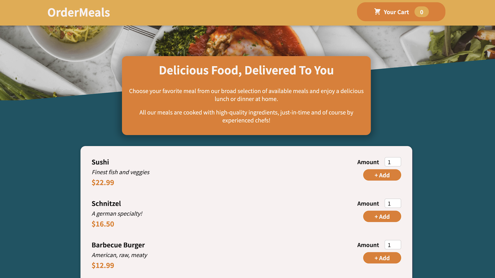
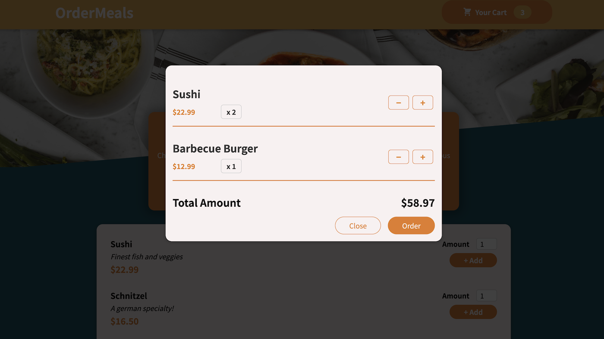
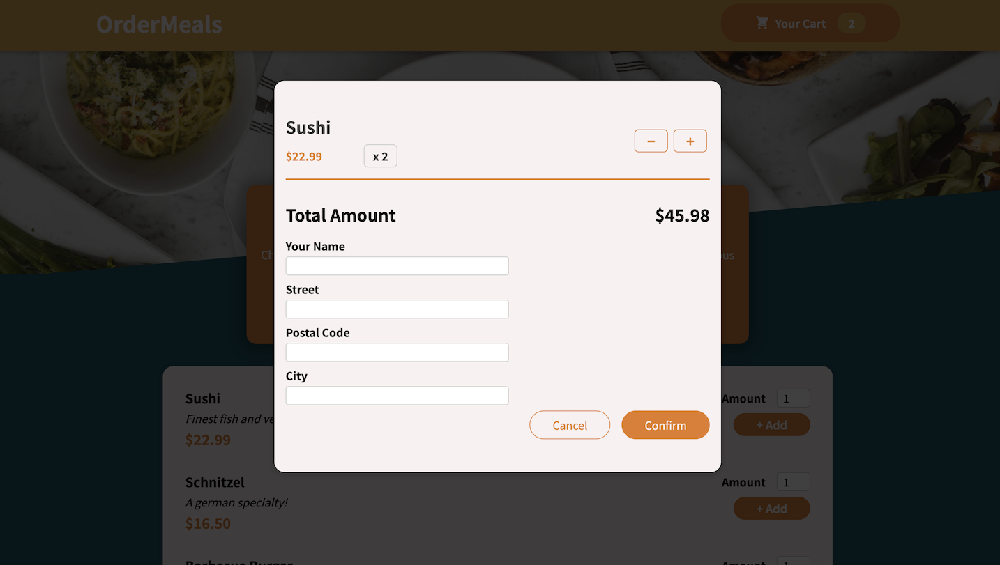

# OrderMeal App







## Technologies

This project is build with Javascript:

- React
- Firebase Realtime DB

## How to run it

* Clone this repo.

   ```console
   git clone https://github.com/zuzanakorma/react-order-meal-app.git
   ```

### Database

1. Go to https://firebase.google.com/

2. Create account

3. Click Get started and Add project

4. Enter your project name & create project

5. Under Build, choose Realtime Database and create one on your preferred location. When asked for security rules, choose `test mode`. Please be aware this mode allows read/write to anybody who gets the database URL.

6. Copy reference url from firebase website and paste it into your `src/url/firebase-url.example.js` file.

7. Rename `firebase-url.example.js` to `firebase-url.js`

8. Before running the app, you can create your meals in firebase db one by one or use Import JSON option - find data in `src/meals.json` .


### Frontend

1. Open a terminal

2. Move to directory `client`

   ```console
   cd client
   ```

3. Run the commands

   ```console
   npm install && npm start
   ```

4. Make sure the application keeps running in case you close the terminal

## How to access the application

Visit: http://localhost:3000

